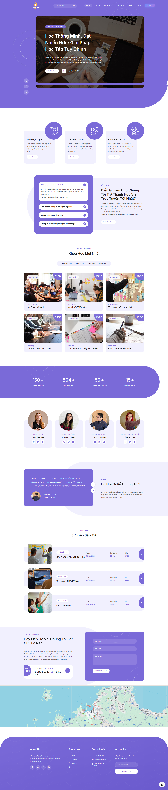

## Overview

BrightLearn is a cutting-edge e-learning platform tailored for high school students. It leverages AI to create personalized learning paths, generate smart exams, and provide instant feedback through Google's Gemini API. With features like real-time collaboration tools and a teacher platform for sharing exam materials, BrightLearn empowers both students and educators to enhance learning outcomes effectively.

## UI/UX

## Key Features

- E-commerce platform
- Sales management system
- Server-side rendering, Static page generation
- Responsive UI with animations both user and admin side
- Form validation system
- Server action for communicate with database

## Technical Stack

### Frontend
- Next.js 14 platform
- TailwindCSS for styling
- TypeScript for type safety
- Form validation libraries
- Admin dashboard for managing products, orders, users, landing pages, etc.

### Backend & Infrastructure
- MongoDB for database
- Prisma ORM
- Docker containerization
- Server-side rendering (SSR), Static site generation (SSG)
- [Vercel for deployment](https://scodenjnja.store/en) or [AWS EC2 with self-hosted MongoDB](https://release.scodenjnja.store/en)

## Implementation Details

- Built a scalable Next.js platform with server-side rendering
- Implemented static page generation for improved performance
- Developed responsive UI using TailwindCSS
- Created smooth animations for enhanced user experience
- Containerized application using Docker

## Role & Responsibilities

- Led full-stack development
- Architected the platform structure
- Implemented server-side rendering
- Developed responsive UI components
- Set up Docker containerization
- Integrated database with Prisma ORM
- Managed deployment and infrastructure

## Technical Achievements

- Optimized page load times through SSR and SSG
- Improved SEO through proper meta tags and SSR
- Enhanced user experience with responsive design
- Implemented efficient data fetching strategies
- Ensured type safety with TypeScript 

## Screenshots

 

  <Image src="./assets/brightlearn/2.png" alt="BrightLearn" />
  <Image src="./assets/brightlearn/3.png" alt="BrightLearn" />
  <Image src="./assets/brightlearn/4.png" alt="BrightLearn" />

 