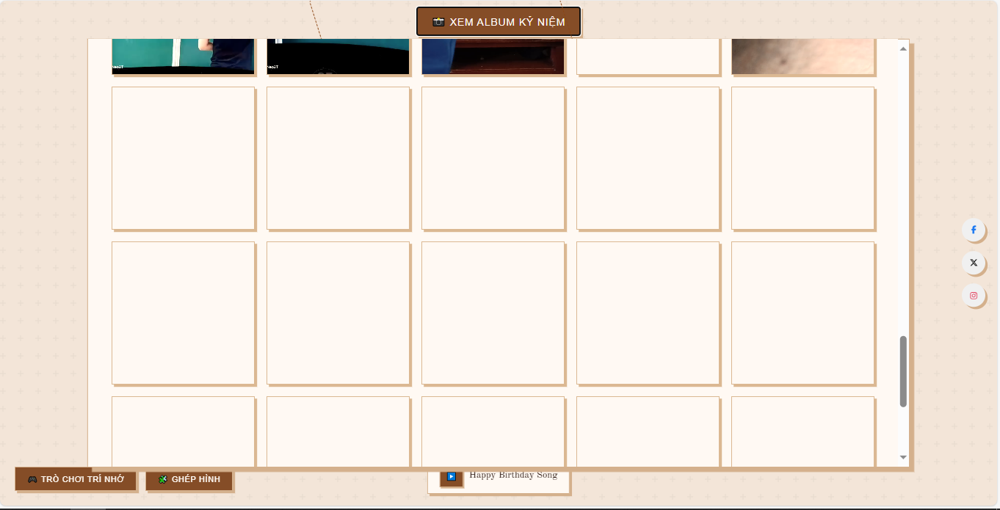

## Tổng Quan

Bạn đã bao giờ muốn có một nơi để cả nhóm bạn thân cùng tổ chức sinh nhật và lưu giữ những kỷ niệm đáng nhớ chưa? **Website Lưu Giữ Kỷ Niệm và Chúc Mừng Sinh Nhật** chính là nơi đó! Tôi là **Vũ Đức Dũng**, và đây là dự án tôi tạo ra để giúp nhóm bạn của mình không bao giờ quên những ngày đặc biệt, đồng thời lưu lại những khoảnh khắc vui vẻ – từ tấm ảnh “dìm hàng” đến những lời chúc đầy yêu thương.

Dự án này sử dụng các công nghệ web đơn giản nhưng mạnh mẽ như HTML, CSS, JavaScript, kết hợp với Web Audio API và Canvas API để mang đến trải nghiệm tương tác vui nhộn. Từ đếm ngược sinh nhật, bánh 3D lung linh, đến album ảnh kỷ niệm, website là một không gian trực tuyến để cả nhóm cùng cười, cùng nhớ, và cùng gắn bó.

## UI/UX

Website được thiết kế với giao diện đơn giản, thân thiện và đầy màu sắc, mang lại cảm giác như một bữa tiệc sinh nhật thực sự:
- **Trực quan và dễ dùng**: Bố cục rõ ràng, ai cũng có thể khám phá ngay từ lần đầu.
- **Hiệu ứng sinh động**: Pháo hoa, bóng bay, và bánh sinh nhật 3D tạo không khí vui tươi.
- **Responsive**: Hoạt động mượt mà trên điện thoại, máy tính bảng, và máy tính.
- **Tương tác độc đáo**: Người dùng có thể thổi nến qua microphone, mang đến trải nghiệm như thật.

## Các Tính Năng Chính

- **Đếm ngược sinh nhật**: Hiển thị thời gian còn lại đến ngày sinh nhật tiếp theo trong nhóm, giúp mọi người chuẩn bị trước.
- **Bánh sinh nhật 3D**: Bánh 3 tầng lung linh với nến, hỗ trợ tương tác thổi nến bằng microphone.
- **Album ảnh kỷ niệm**: Lưu trữ và xem lại những khoảnh khắc đẹp, từ chuyến đi chơi đến tiệc sinh nhật.
- **Nhạc sinh nhật**: Phát nhạc chúc mừng vui nhộn, tạo không khí tiệc tùng.
- **Hiệu ứng tương tác**:
  - Pháo hoa rực rỡ khi thổi tắt nến.
  - Bóng bay bay khắp màn hình khi nhấn vào bánh.
- **Chia sẻ mạng xã hội**: Đăng lời chúc hoặc ảnh kỷ niệm lên Facebook, Twitter, Instagram.
- **Trò chơi giải trí** (đang phát triển):
  - Trò chơi Trí nhớ: Tìm cặp ảnh giống nhau.
  - Trò chơi Ghép hình: Sắp xếp ảnh nhóm bị xáo trộn.

## Công Nghệ Sử Dụng

### Frontend
- **HTML5**: Cấu trúc nền tảng của trang web.
- **CSS3**: Thiết kế giao diện đẹp mắt, hiệu ứng mượt mà như pháo hoa và bóng bay.
- **JavaScript (ES6+)**: Xử lý logic tương tác, từ đếm ngược đến trò chơi.
- **Web Audio API**: Hỗ trợ tính năng thổi nến và phát nhạc sinh nhật.
- **Canvas API**: Vẽ bánh sinh nhật 3D và các hiệu ứng động.
- **Local Storage**: Lưu dữ liệu sinh nhật và ảnh để không mất khi tải lại trang.

### Cơ Sở Hạ Tầng
- **Static Hosting**: Triển khai nhanh trên nền tảng như Render.
- **GitHub**: Quản lý mã nguồn và tài liệu.

## Chi Tiết Kỹ Thuật

- **Đếm ngược sinh nhật**: Sử dụng JavaScript Date API để tính toán thời gian thực đến ngày sinh nhật, cập nhật giao diện mỗi giây.
- **Bánh sinh nhật tương tác**: Kết hợp Canvas API để vẽ bánh 3D và Web Audio API để phân tích âm thanh từ microphone, kích hoạt hiệu ứng khi phát hiện “thổi”.
- **Album ảnh**: Dùng Local Storage để lưu danh sách ảnh, hiển thị dưới dạng gallery với CSS Grid.
- **Hiệu ứng pháo hoa và bóng bay**: Tạo hoạt ảnh bằng CSS keyframes và JavaScript để điều khiển thời gian.
- **Chia sẻ mạng xã hội**: Tích hợp API chia sẻ của các nền tảng (Facebook, Twitter, Instagram) qua URL động.
- **Trò chơi**: Thiết kế logic cơ bản cho Trí nhớ và Ghép hình bằng JavaScript, dự kiến hoàn thiện trong tương lai.

## Thách Thức & Giải Pháp

1. **Thách thức: Tính năng thổi nến bằng microphone**
   - **Vấn đề**: Xử lý âm thanh thời gian thực khó khăn, đặc biệt trên các thiết bị yếu.
   - **Giải pháp**: Tinh chỉnh Web Audio API để giảm độ nhạy, đảm bảo hoạt động trên cả điện thoại giá rẻ.

2. **Thách thức: Tối ưu hiệu suất**
   - **Vấn đề**: Hiệu ứng Canvas (pháo hoa, bóng bay) gây lag trên thiết bị cũ.
   - **Giải pháp**: Giảm số lượng particle trong hiệu ứng và dùng requestAnimationFrame để tối ưu rendering.

3. **Thách thức: Lưu trữ ảnh cục bộ**
   - **Vấn đề**: Local Storage có giới hạn dung lượng, khó lưu nhiều ảnh.
   - **Giải pháp**: Nén ảnh trước khi lưu và khuyến khích người dùng chọn ảnh dung lượng thấp.

## Vai Trò & Trách Nhiệm

- Thiết kế ý tưởng và tính năng cho website.
- Xây dựng giao diện và logic tương tác bằng HTML, CSS, JavaScript.
- Tích hợp Web Audio API và Canvas API cho các tính năng độc đáo.
- Tối ưu hóa hiệu suất trên nhiều thiết bị.
- Viết tài liệu hướng dẫn sử dụng và tùy chỉnh.
- Triển khai website trên nền tảng tĩnh.

## Thành Tựu Kỹ Thuật

- **Tính năng thổi nến**: Tạo trải nghiệm tương tác độc đáo, hoạt động trên hầu hết thiết bị.
- **Giao diện responsive**: Hỗ trợ mọi kích thước màn hình, từ điện thoại đến máy tính.
- **Hiệu ứng sinh động**: Pháo hoa và bóng bay mang lại không khí tiệc tùng thực sự.
- **Album kỷ niệm**: Lưu trữ và hiển thị ảnh mượt mà, dễ dàng chia sẻ.
- **Khả năng mở rộng**: Thiết kế nền tảng để dễ thêm trò chơi và tính năng mới.

## Ảnh Giao Diện

  

    
    
Màn hình chính với đếm ngược sinh nhật

  

  

    
    
Bánh sinh nhật 3D và hiệu ứng pháo hoa

  

